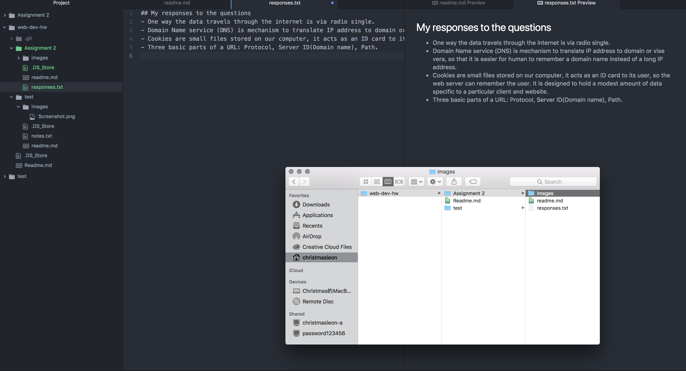

# Assignment 2
Version Control System (VCS) Is a system that allows users to look into the past workflow, it is a very effective tool for viewing what changes users have made in the past, and it also shows the exact when and how the user changed it. VCS makes collaboration much easier, people can working on the same file at different places at same time.

Here is my [responses](./responses.txt)

I had a lot of difficulties go through this assignment, as a foreigner who native language isn't English, learning how to write codes added another layer to my workflow, but the results are rewarding.  I did a lot of test on Github before I started working on the real one, I also learned that in coding, I have to write my own extension, It took me a while to figure out how to create a .txt file. But once I understood it, it's hard to miss it again.

