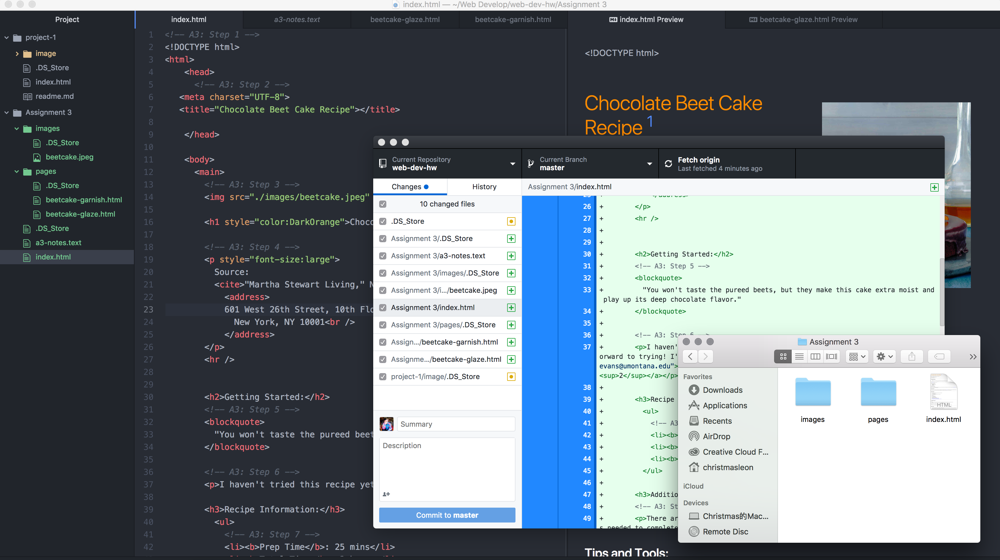

# Technical Report#
---
 According to W3C standard, only one *head* and *body* element is allowed in a page.

- *head* element is a container for all the *head* elements.
The *head* element can include a title for the document, scripts, styles, meta information, and more. *Head* contains high-level information about a website, and it always comes first within the root element.
- *body* element is a container for all the *head* elements.
The *body* element contains all the contents of an HTML document, such as text, hyperlinks, images, tables, lists, etc.

In short, Structural Markup helps make the webpage readable to viewers. It also helps browsers to categorize the importance of the information.  The Semantic Markup enhances accessibility, internationalization, and interoperability.

#### Work Cycle
This is a very interesting assignment, it opened my eyes more about the coding world, during the work cycle, I cannot help myself but to kept going online search for new knowledges about html and coding in general. At the beginning it all seems very complicated, but once I found the pattern of the code and understood its rules, it all makes sense now.

The problem I had during this assignment, was that my "Back to Home" didn't work at the beginning, but I then fixed it by recheck the code carefully, I located a typo.

I learned many things in this assignment, now I'll always use my developer tools in the browser to try to read and learn the code of certain websites.

