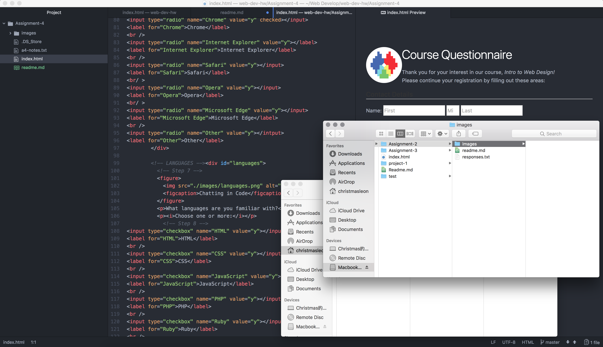

# Technical Report
---
**Alt text**

Alt text also known as alt attributes, is used in HTML to describe the function of an image on the page.

**Forms**

The most common form I have come across while browsing a website is the Username and Password forms. Its purpose is of course allow me to enter my username and password and send them to the website server, I think it is critical that these forms exist, no matter it is text-field form or a simple radio form, it gives a certain level of interaction between users and websites.

**Work Cycle**

The more I get into coding, the more I respect professional web developers. Even a simplest website needs a lot of work in order to make it beautiful and clean. I spent way more time on this week's assignment, but when I saw the finished result, the sense of achievement is incomparable.
Before I push my work to my live website, I found out all my html files has disappeared, fortunately I have all the previous back up files on my hard drive, otherwise I believe I am going to redo them all again. And I am still look for the reason why this happened in the first place.

 
