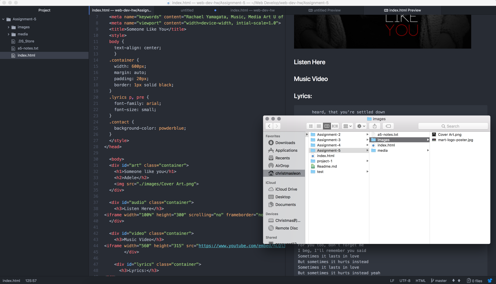

# Technical Report
- To put it simple, you can use divs and spans together, but the difference between them is that, divs should be use to wrap a whole section while spans can only be use to wrap a small portion of the content inside divs tags.
- ID is unique in each page, one element can only use one ID, meanwhile class is not unique in each page, different elements can share the same class, and you can also use multiple classes on the same element.
- The first benefit of using a third-party hosted media is that it's much easier, every code has already been written out for you. The second benefit would be the bandwidth problem, although self-hosted media gives the programmer the full control of the content, but when traffic getting heavy on your website, the bandwidth usage would make the media unplayable. The third benefit would be the file size, third-party hosted media file is much smaller, which can make the webpage load much faster.
---
# Work Cycle
With the class's materials become more and more advance, it requires me to remember what we've learned in the past. While it is great that we have all the contents still provided to us on the website, it also made me nervous about what will be our next task. The biggest problem I had in this assignment is that Atom's preview window seems cannot read certain codes, while I tried to use the preview window to check my form and tags, nothing shows up there. The only solution I came up is to load my index.html in my browser every time I wanted to check if there was any error, which can get frustrating for a while.

  
