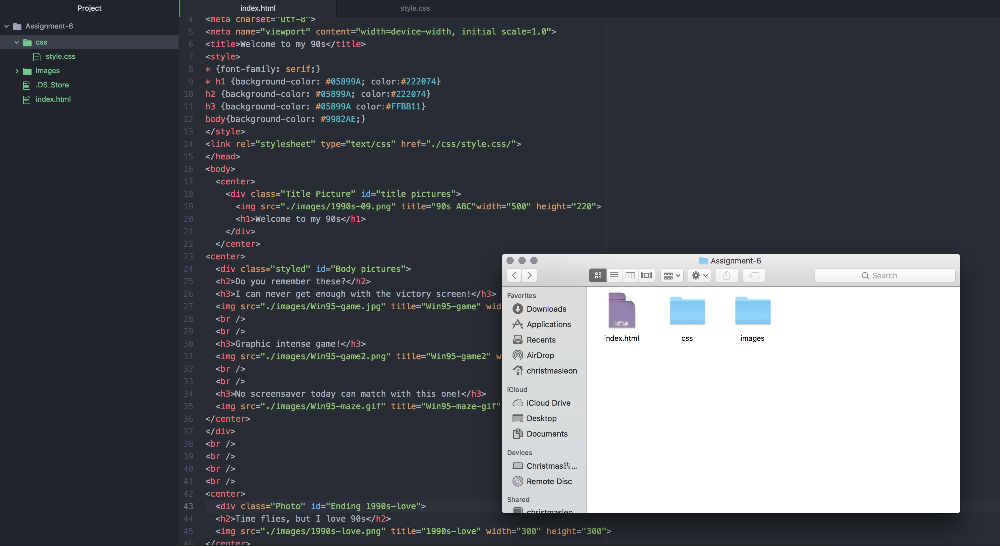

# Technical Report
---
- I chose 90s for this assignment because I was born in that area, when styling my page I tend to make it bold and shinning, I used very contrast color to make everything pop.
The three pictures I choose for this assignment are three "mini games" I used to "play". I think they are a great representation of my area.
- The color I used was called: Kaycee Orange {#FFBB11}, Stardoll B!tch {#05889}, Nuit {#222074}, Bee{#FFCC00} and Fading Violet {#9982AE}.   I use these color because they creates a great contrast for each other, and it also works with the pictures I chose for the site.
- This assignment was less interesting that I thought it would be, the more I dig into it, the more I appreciate web developers, and how much time it would take to create a beautiful website. I think I still has a misunderstanding on the "order" part of the CSS, and how to correctly override certain code. But the website looks okay for me, certainly not the best.

