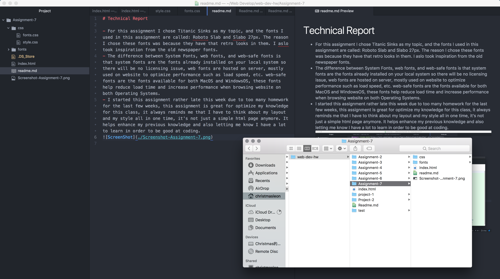

# Technical Report

- For this assignment I chose Titanic Sinks as my topic, and the fonts I used in this assignment are called: Roboto Slab and Slabo 27px. The reason I chose these fonts was because they have that retro looks in them. I aslo took inspiration from the old newspaper fonts.
- The difference between System Fonts, web fonts, and web-safe fonts is that system fonts are the fonts already installed on your local system so there will be no licensing issue, web fonts are hosted on server, mostly used on website to optimize performance such as load speed, etc. web-safe fonts are the fonts available for both MacOS and WindowsOS, these fonts help reduce load time and increase performance when browsing website on both Operating Systems.
- I started this assignment rather late this week due to too many homework for the last few weeks, this assignment is great for optimize my knowledge for this class, it always reminds me that I have to think about my layout and my style all in one time, it's not just a simple html page anymore. It helps enhance my previous knowledge and also letting me know I have a lot to learn in order to be good at coding.

