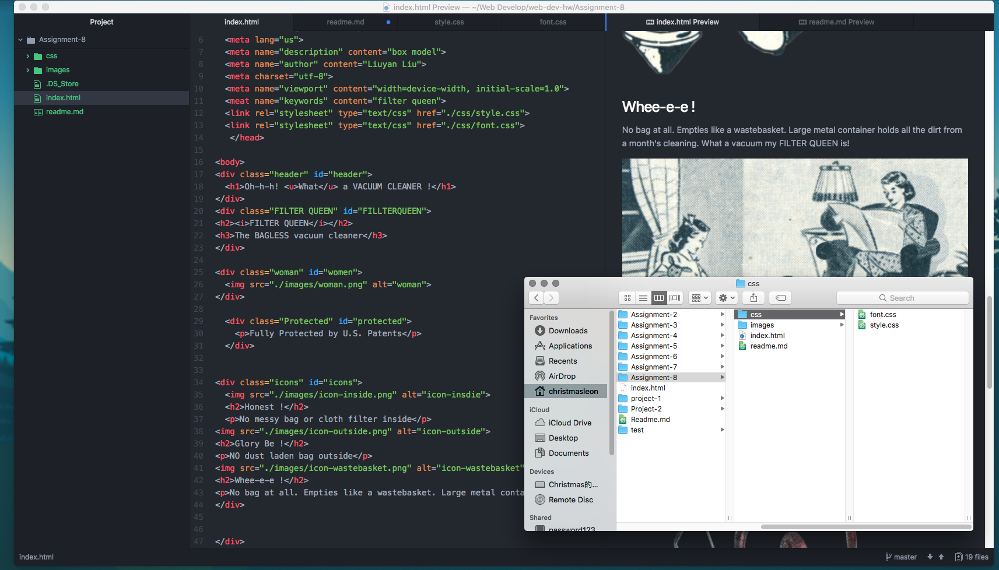

## Technical Report

- The relationship between Padding, Boarder and Margin is that, padding is a space given inside the border of the container element and margin is given outside.

- This assignment is the hardest assignment I had in this semester, the whole assignment require me to use all the knowledge we learned from this semester, I am not saying I didn't learned a thing, I firmly understood the basics of HTML and CSS, but to put them together and use them as a whole made me just lost myself in the process, if I have to pick a hardest part, then it has to be the layout.  

- This is by far the worst assignment I have ever submitted, I knew I can't make it looks like original piece, but I really want to make it look good. I spend so many time on this assignment tried to find a smart way to organize the content, but I end up lost in those colorful lines, in the end, I just give up trying, this assignment made me questioning my own intelligence.

 
