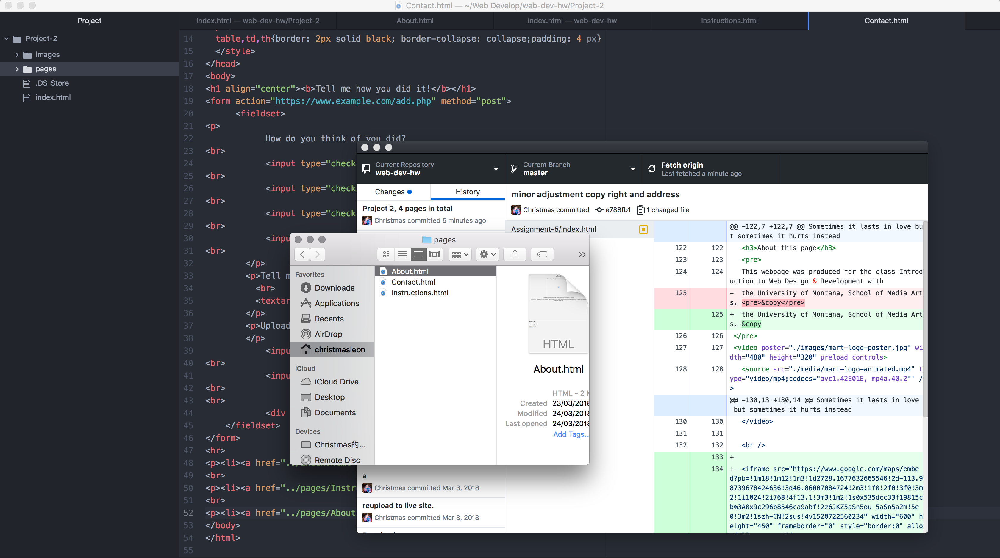

# Technical Report
- As a film student, I never thought I would need to learn coding or anything related to computer coding, now that we are half way through this semester, I think the biggest thing I learned in this course is that coding is also a way of creating. As a person who learn coding from ground up I must say now I have a whole new appreciation for web developers. There is nothing old for me in coding world, and in terms of interesting, I'd say everything new interests me, but, this is very difficult.
- I am very exciting about what we are going to learn in next topic, just as I am very anxious about it as well!
---
- This project took me a total of 3 days to complete. I had to go back and refresh myself with all the previous topics. This is very nerve wrecking, and frustrating. By the time I completed a total of four pages of codes, I am somewhat proud of myself. But it was just, too much.... It even took Github about 5 minutes to upload all 4 pages.

