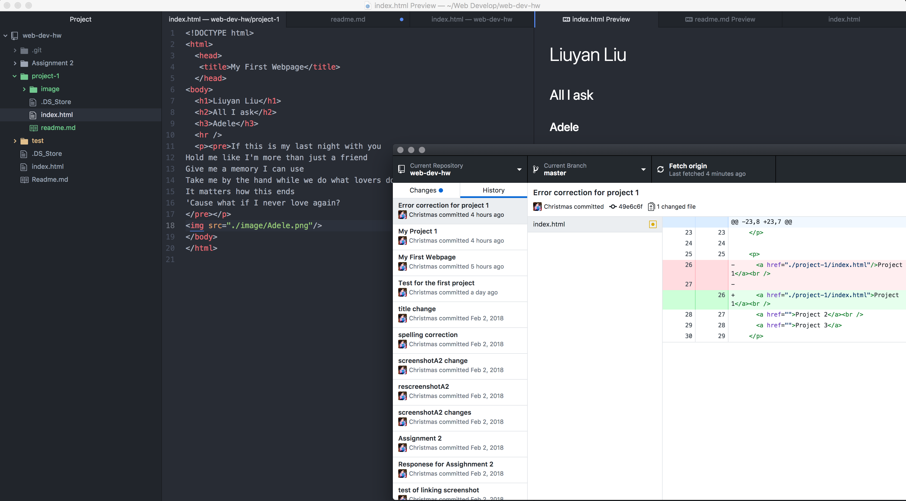

# Technical Report
---

- I mainly use Safari on my Mac machine and iPhone, and use Chrome on my Windows machine.

- Since I am learning this course using my Macbook, I use Safari for web devoloping and testing.

- Every web browser has a rendering engine and a browser engine. Rendering engine takes both HTML and CSS documents, browser engine directs Rendering engine and user interface, it also communicates with outside servers to fetch the necessary documents and images in order to make the webpage display properly. Each browsers has its own Javascript interpreter to help imply interactive logics and functionalities.

Wayback Machine brought back many of my childhood memories. I went to Baidu.com which is China's largest search engine, basically a Chinese Google, but all things China. Surprisingly, the website doesn't exists prior than the year 2000, the earliest snapshot from the website is from June 6, 2000. It's like a web introduction. And more surprisingly, the layout of the website back then is almost identical to today's website, but the font and the texture of the website is much refined today.

This assignment is quite tricky for me, by slowly and carefully learning the basics behind HTML tags and the how browsers functioning, I now had a basic understanding of how everything works.

!
